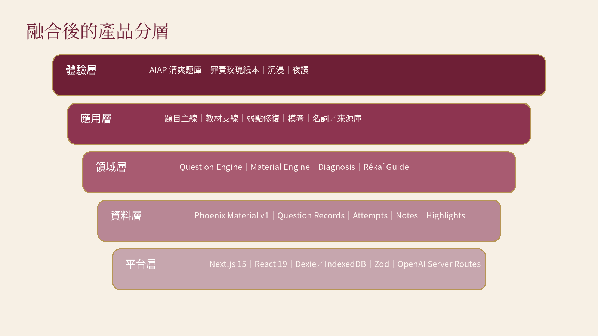
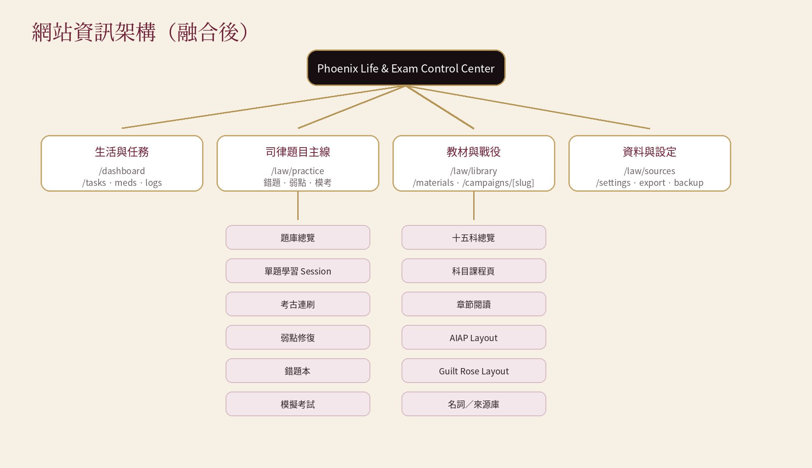
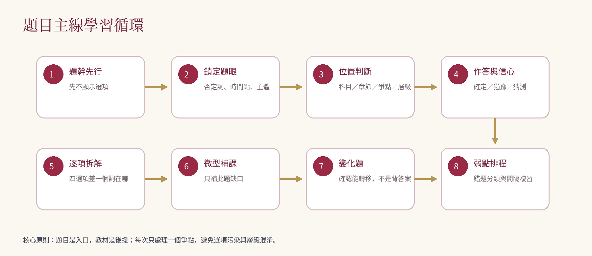

# 鳳凰行動：司律題目主線 × 五套主題 × 完整章節系統

**Phoenix Life & Exam Control Center 統一產品／資訊架構／資料契約／實作規格書**

- 版本：v2.0
- 日期：2026-07-17
- Repository：`Phoenix910102/phoenix-life-exam-control-center · codex-progress`

## 文件控制與適用範圍

| 欄位 | 內容 |
| --- | --- |
| 文件名稱 | 鳳凰行動：司律題目主線 × 五套主題 × 完整章節系統 |
| 文件版本 | v2.0 |
| 建立日期 | 2026-07-17 |
| 目標 Repository | Phoenix910102/phoenix-life-exam-control-center · codex-progress |
| 文件定位 | Codex、開發者與內容製作者共同遵循的唯一工程規格；不是概念提案，也不是單純 UI 指南。 |
| 優先順序 | 本文件 > 已核准 ADR／migration 規則 > 現有程式行為 > 舊版單檔 HTML 與預覽圖。 |
| 第一階段交付 | 刑法題目主線 vertical slice、AIAP Soft Study、Guilt Rose Academy、共用進度與內容 Patch 管線。 |

> 核心判斷：題目是入口，教材是後援；同一份內容只維護一次，外觀與學習模式可以切換，但作答、進度、錯題、筆記與來源永遠共用。

本規格整合四套既有視覺原型（AIAP Soft Study、Lavender Notebook、Midnight Academy、Modern Law School）、罪責玫瑰世界觀、Question-first 題目引擎、十五科章節體系，以及目前 GitHub 已完成的 phoenix.content-patch.v1 基礎。

---

## 1. 執行摘要與不可變更決策

### 1.1 產品定位

鳳凰行動不是一個單純的電子課本，也不是題庫外掛。它是 Phoenix 個人的司律備考作業系統：以官方考古題作為學習入口，透過題眼定位、逐項拆解、微型補課、變化題與弱點排程，把每一題轉換成可追蹤的知識節點。

### 1.2 九項不可變更決策

- Question-first：首頁與日常主線優先進入題目，而不是要求先讀完整章節。
- Single Source of Truth：題目、教材、來源與法條版本只存一份；五套 Layout 只負責呈現。
- Local-first：個人作答、筆記、錯題與進度預設保存在 IndexedDB；搬機前可匯出完整備份。
- 內容與個人資料分離：教材／題庫更新不能覆蓋 Phoenix 的作答與學習歷史。
- 官方題與 AI 題嚴格分流：來源、母題、生成方式、審核狀態必須可見。
- 增量更新：內容透過 phoenix.content-patch.v1 或後繼相容版本進場，不重建整份教材包。
- 章節完整度可驗證：每個正式章節必須通過 11 區塊完整度與來源檢查。
- 主題不是色票：五套主題必須具備不同資訊布局、導航方式與互動節奏，不能只替換 CSS 變數。
- 法規／裁判具有版本與 freshness：任何可能變動的內容都必須可回溯至適用日期與來源。

### 1.3 現行考試範圍基準

本系統第一階段以司法官、律師第一試為主。現行第一試總分 600 分，綜合法學（一）與綜合法學（二）各 300 分；系統內十五科排序、權重與今日選題策略應以官方配分作為預設，而不是平均分配。

| 試卷 | 科目與預設權重 |
| --- | --- |
| 綜合法學（一） | 憲法 40、行政法 70、刑法 70、刑事訴訟法 50、國際公法 20、國際私法 20、法律倫理 30 |
| 綜合法學（二） | 民法 100、民事訴訟法 60、公司法 30、保險法 20、票據法 20、強制執行法 20、證券交易法 20、法學英文 30 |

配分必須存於 manifest，可隨規則更新；程式不得把上述數字散落硬編碼在頁面元件。

---

## 2. Repository 現況基準與缺口

### 2.1 已存在且必須保留

- Next.js 15 App Router、React 19、TypeScript、Tailwind CSS。
- Dexie／IndexedDB local-first 資料庫，現行 schema 版本為 4。
- phoenix.material.v1 教材協議、Zod 驗證、MaterialExperience 呈現分流。
- CampaignThemeProvider 與 reading／immersive／night 閱讀模式。
- ImmersiveAcademy 的總覽、戰場、閱讀、上課、決鬥、診斷、陷阱、測驗、名詞庫、題庫、來源庫與快速複習模組。
- 原生 AIAP 中級教材包與刑事訴訟法 29 章教材包。
- phoenix.content-patch.v1、/law、/law/content-inbox、Patch schema 驗證與差異預覽。

### 2.2 目前只是殼或尚未完成

| 項目 | 現況 | 本規格要求 |
| --- | --- | --- |
| 題庫主線 /law/practice | Placeholder | 建立完整 Session state machine 與真實作答流程 |
| 錯題／弱點／模考／名詞／來源 | Placeholder 或未串接 | 接入正式資料表與可操作頁面 |
| 五套主題 | 只有既有殼色票與部分沉浸樣式 | 新增五個獨立 Presentation Layout |
| 完整法律章節 | 只有刑訴 29 章；其他法律科目未完整進場 | 建立十五科 manifest 與逐章 Patch 管線 |
| 十一區塊章節 | 已有部分 block type，沒有完整章節資料 | 建立完整度規則、法律專用 block 與示範章 |
| 內容發布 | Patch 只能驗證與匯出 | 新增 Review → Apply → Publish → Rollback |
| 筆記／書籤／畫線 | 尚未正式建表 | Dexie v5 新增共用閱讀狀態 |

### 2.3 禁止誤判完成

- 存在路由不等於功能完成。
- 存在主題名稱不等於獨立 Layout 完成。
- 存在章節標題不等於十一區塊完整。
- 存在題幹與正解不等於可教學題目完成。
- 存在 Patch 驗證不等於內容已套用正式題庫。

---

## 3. 統一產品分層



| 層級 | 責任 | 禁止事項 |
| --- | --- | --- |
| 體驗層 | 五套 Layout、reading／immersive／night、桌面與手機響應式 | 不得持有獨立題庫或獨立進度 |
| 應用層 | 題目主線、教材支線、弱點修復、模考、名詞與來源 | 不得直接散落資料庫操作 |
| 領域層 | Question Engine、Material Engine、Diagnosis、Review Scheduler、Rékaí Guide | 不得依賴特定視覺主題 |
| 資料層 | Content records、Attempts、Notes、Highlights、Patches、Sources | 內容與個人狀態分表 |
| 平台層 | Next.js、React、Dexie、Zod、server-side AI routes | 不得暴露 API key 或把私密資料送至不明服務 |

---

## 4. 網站資訊架構與路由



### 4.1 一級導航

| 區域 | 路由 | 用途 |
| --- | --- | --- |
| 生活中控台 | /dashboard、/command-center | 生活、任務、用藥、考試與總覽 |
| 司律主線 | /law | 今日題目、十五科、弱點與內容狀態 |
| 題庫主線 | /law/practice | 選題、篩選、連刷、Session 建立 |
| 教材中心 | /law/subjects、/law/chapters | 章節課本與題目反向連結 |
| 錯題與弱點 | /law/wrong-book、/law/weakness | 錯誤歷史與複習佇列 |
| 模擬考場 | /law/mock-exams | 限時、無提示、考後復盤 |
| 名詞／來源 | /law/glossary、/law/sources | 跨章索引、法條、裁判、答案版本 |
| 內容營運 | /law/content-inbox、/law/content-review | Patch 驗證、審核、發布與回滾 |

### 4.2 建議完整路由

```text
/law
/law/practice
/law/practice/session/[sessionId]
/law/practice/question/[questionKey]
/law/wrong-book
/law/weakness
/law/review-queue
/law/mock-exams
/law/mock-exams/[examId]
/law/subjects/[subjectKey]
/law/chapters/[chapterKey]
/law/glossary
/law/glossary/[termKey]
/law/sources
/law/sources/[sourceKey]
/law/content-inbox
/law/content-review
/law/content-history
/law/settings
/materials
/campaigns/[slug]
```

### 4.3 首頁優先序

- 第一順位：繼續上一題／今日應複習題。
- 第二順位：考古連刷與弱點修復。
- 第三順位：十五科進度、預設配分權重與考前高頻。
- 第四順位：教材查閱、名詞與來源。
- 內容收件匣屬管理功能，不應取代 Phoenix 日常學習入口。

---

## 5. 題目主線：完整學習循環



### 5.1 Session 狀態機

```text
idle
  → stem-only
  → signal-lock
  → issue-prediction
  → options-visible
  → answer-selected
  → confidence-locked
  → submitted
  → option-analysis
  → micro-lesson
  → variant-question
  → completed / queued-for-review
```

任何重新整理、主題切換或裝置旋轉都不能讓 Session 回到初始狀態。狀態必須持久化並可恢復。

### 5.2 每題必備九步

| 步驟 | 使用者看到什麼 | 系統紀錄 |
| --- | --- | --- |
| 1 題幹先行 | 只顯示題幹，不顯示選項 | stemViewedAt、duration |
| 2 鎖定題眼 | 否定詞、時間點、主體、實務／學說限定 | negativeLocked、selectedSignals |
| 3 位置判斷 | 科目、章節、爭點、三階層／程序位置 | issuePrediction、positionConfidence |
| 4 作答與信心 | 顯示選項後作答；確定／猶豫／猜測／改答／看不懂 | selectedIndex、confidence、changedAnswer |
| 5 逐項拆解 | 四個選項各自判定、錯字詞與最小修正 | optionAnalysisOpened |
| 6 微型補課 | 只補本題缺口；可跳回完整教材 | microLessonOpened、lessonRefs |
| 7 變化題 | 同爭點換事實、主體、時間或問法 | variantOf、transferResult |
| 8 弱點排程 | 錯誤分類、間隔複習、猜對也追蹤 | errorCategories、nextReviewAt |
| 9 完成／下一題 | 推薦下一題理由可見 | recommendationReason |

### 5.3 題目畫面必要區域

- 題目身份列：年度、考試、科目、題號、來源類型、法條版本、審核狀態。
- 題幹紙面：可調字級、行距、選取筆記；否定詞僅在 Phoenix 主動要求或完成鎖定後醒目。
- 位置判斷器：一次只問一件事，避免同時塞入科目／章節／爭點多個下拉選單。
- 選項區：顯示後才開始答案計時；支援單選與複選。
- 信心控制：五種固定狀態，不使用模糊滑桿。
- 解析區：正確與錯誤選項都必須解析，且標示最小差異。
- Rékaí 導讀：以追問、提示與拆解為主，不直接在作答前洩漏答案。
- 微型教材：可展開對應的章節區塊、法條、裁判、名詞與考古連結。

---

## 6. 超大量題庫與內容品質

### 6.1 題目來源層級

| 類型 | 識別 | 可否進正式模考 | 最低要求 |
| --- | --- | --- | --- |
| 官方原題 | official | 可以 | 原文、官方答案／更正、來源、年度、題號 |
| 官方題改寫 | derived-from-official | 審核後可以 | 母題、改寫範圍、不可冒充官方原題 |
| 選項拆解題 | derived-from-official | 審核後可以 | 母題選項與拆解規則 |
| AI 變化題 | ai-generated | 僅 human-reviewed／published | 母題、生成 profile、法條版本、審核紀錄 |
| Phoenix 自建題 | user-authored | 審核後可以 | 建立者與來源說明 |
| 待修正／退役題 | retired | 不可以 | 退役原因與歷史作答保留 |

### 6.2 擴充策略

- 每一官方選擇題可拆成 4-8 個選項級判斷節點。
- 每一核心爭點可生成 2-6 題最小差異變化題。
- 變因包含：人物、主體資格、時間點、故意／過失、程序階段、法條修正前後、實務／學說限定、肯定／否定問法。
- 題庫量可以快速成長，但正式發布必須由內容審核閘門控制；數量不能凌駕可追溯性。

### 6.3 AI 題發布閘門

```text
draft
  → machine-checked
  → source-verified
  → human-reviewed
  → published
  → revised / retired
```

- AI 題不可在 Patch 內直接宣告 human-reviewed 或 published。
- 無母題或無法條／來源依據的 AI 題不得進正式題庫。
- 答案更正新增 answer revision，不能覆寫歷史答案。
- 使用者作答紀錄永遠指向當時 answer revision，以避免事後重算污染歷史。

---

## 7. 完整章節規格

### 7.1 正式章節的十一區塊

| 序 | 區塊 | 必備內容 | 驗收條件 |
| --- | --- | --- | --- |
| 1 | 📚 章節導讀 | 本章位置、範圍、關鍵字、為何重要 | 80-120 字；可由題目直接跳入 |
| 2 | 🗺️ 條文地圖 | 條號、目的、關聯與版本 | 至少一個來源；條文版本可見 |
| 3 | 🏗️ 概念框架 | 要件→效果→例外或程序時間軸 | 可機讀 steps／nodes，不只圖片 |
| 4 | 🧠 理論精解 | 核心學理與特殊概念、短例 | 每個論點 2-3 行；附關聯詞 |
| 5 | ⚖️ 爭點拆解 | 學說／實務對立、判斷流程 | 比較表或決策樹；不可只列結論 |
| 6 | 📑 實務精要 | 近年重要裁判／憲法法庭／大法庭 | 字號、年份、要旨、適用爭點 |
| 7 | 🎯 考古連結 | 年度、題號、母題與變化題 | 至少一題或明示本章暫無官方題 |
| 8 | ⚠️ 易錯陷阱 | 常見誤判 2-5 條 | 與 errorCategory 可對應 |
| 9 | 🔮 押題趨勢 | 可能命題方向與依據 | 標記推測、更新日、不得冒充官方資訊 |
| 10 | 🔗 圖表／流程 | 流程圖、概念圖、時間軸 | 文字 fallback 與可存取標籤 |
| 11 | ✏️ 自我測驗 | 3-10 題 Quick Quiz | 提交後逐項解析；可寫入進度 |

### 7.2 章節完整度分數

```text
chapterCompleteness =
  requiredBlocksPresent 40%
  sourceCoverage        20%
  questionLinks         15%
  practicalUpdates      10%
  accessibility         10%
  editorialReview        5%
```

只有完整度達 80% 且沒有 critical validation error 的章節可標為「可學習」；達 95% 且通過人工審核才可標為「完整章」。

### 7.3 章節與題目的雙向關係

- 題目可連到多個章節／爭點，但必須有一個 primary issue。
- 章節中的考古標籤可直接開始對應 Session。
- 微型補課只引用章節 block，不複製正文。
- 章節更新後，既有題目關聯不因排序變動失效；必須使用 stable key。

---

## 8. 十五科 manifest 與章節藍圖

十五科採「一科一個 package + 一份 legal-campaign.manifest.json」策略。章節數與節點數由 manifest 動態計算，程式不得依賴固定總數。以下是第一版章節藍圖；內容可透過 Patch 增修，但 stable key 一經發布不得任意更名。

| subjectKey | 科目 | 第一試權重 | 第一版章節數 | 章節藍圖摘要 |
| --- | --- | --- | --- | --- |
| constitutional-law | 憲法 | 40 | 10 | 憲法基本原理、基本權總論與審查架構、平等權、自由權與人格權、財產權、生存權與社會權、正當法律程序與訴訟權、國家組織與權力分立、國會、行政與司法、違憲審查與憲法訴訟、地方自治與中央地方關係 |
| administrative-law | 行政法 | 70 | 13 | 行政法原理與法律保留、行政組織與公務員法、行政處分、行政契約、法規命令、行政規則與自治法規、行政計畫與行政事實行為、行政程序與聽證、行政罰、行政執行、國家賠償與損失補償、訴願、行政訴訟、暫時權利保護與執行 |
| criminal-law | 刑法 | 70 | 14 | 刑法原理與效力、犯罪成立三階層、客觀構成要件與因果關係、客觀歸責、主觀構成要件與故意過失、違法性與阻卻違法、有責性與責任能力、錯誤論、未遂犯、正犯與共犯、競合與罪數、刑罰論、沒收、分則法益類型與高頻罪名 |
| criminal-procedure | 刑事訴訟法 | 50 | 14 | 基本原則與訴訟主體、偵查程序、強制處分、辯護與防禦權、證據法總論、自白與傳聞、搜索扣押與科技偵查、起訴與不起訴、審判程序、簡式／協商／簡易程序、上訴與抗告、再審與非常上訴、執行與特別程序、現有 29 章 package 應映射至上述領域並保留原 stable key |
| public-international-law | 國際公法 | 20 | 10 | 國際法法源與主體、條約法、國家承認、繼承與管轄、領土、海洋與航空、國家責任、外交與領事關係、國際人權法、武力使用與集體安全、國際組織、國際爭端和平解決 |
| private-international-law | 國際私法 | 20 | 10 | 涉外民事法律適用總論、連繫因素與定性、反致、法律規避與公共秩序、權利能力與行為能力、婚姻、親子與扶養、繼承、債之關係、物權、法人與公司、外國裁判承認執行與國際仲裁 |
| legal-ethics | 法律倫理 | 30 | 8 | 律師職業角色與獨立性、受任、終止與忠實義務、保密義務與揭露例外、利益衝突、報酬、廣告與招攬、法庭倫理與對法院義務、司法官倫理、懲戒與法律扶助 |
| civil-law | 民法 | 100 | 25 | 民法總則：人與權利主體、民法總則：物與權利客體、法律行為與意思表示、代理、消滅時效與期間、債之發生、債之效力、債之移轉與消滅、多數債務人與債權人、買賣與互易、贈與、租賃與使用借貸、承攬、委任與寄託、保證與其他典型契約、無因管理與不當得利、侵權行為、物權通則與所有權、共有與相鄰關係、用益物權、擔保物權、占有、婚姻、親子與監護、繼承總則、遺產繼承、遺囑與特留分 |
| civil-procedure | 民事訴訟法 | 60 | 15 | 基本原則與法院、管轄、當事人與訴訟能力、訴訟代理人與共同訴訟、訴訟標的與訴之利益、起訴、訴之變更追加與反訴、爭點整理與辯論主義、證據與證明責任、訴訟參加與第三人、裁判與既判力、上訴、抗告、再審、簡易與小額程序、督促、保全與其他特別程序 |
| company-law | 公司法 | 30 | 10 | 公司法總論與設立、有限公司、股份有限公司資本與股份、股東與股東會、董事、監察人與公司治理、公司會計與盈餘分派、變更章程與資本變動、合併、分割、解散與清算、關係企業、閉鎖性股份有限公司 |
| insurance-law | 保險法 | 20 | 10 | 保險契約總論、保險利益與保險價額、告知義務與危險增加、保險費與契約效力、複保險、超額與不足額保險、保險代位、財產保險、責任保險、人身保險、保險受益人與保險金請求 |
| negotiable-instruments | 票據法 | 20 | 9 | 票據法總論、票據行為與代理、票據抗辯、偽造、變造與空白授權票據、匯票發票、背書、承兌與保證、匯票付款與追索、本票、支票、票據權利時效與利益償還請求 |
| securities-law | 證券交易法 | 20 | 9 | 公開發行與有價證券募集、資訊公開與財務報告、公司治理與獨立董事、公開收購與大量取得、內線交易、操縱市場、短線交易與歸入權、證券詐欺與不實資訊、民事、刑事與行政責任 |
| compulsory-execution | 強制執行法 | 20 | 12 | 強制執行總論、執行名義與執行當事人、執行法院與執行標的、財產查報與執行限制、動產執行、不動產執行、債權與其他財產權執行、非金錢請求執行、假扣押與假處分執行、分配程序、執行異議與第三人異議之訴、執行救濟與終結 |
| legal-english | 法學英文 | 30 | 10 | 題幹訊號與否定詞、法條句型與定義句、憲法與行政法核心詞彙、刑法與刑訴核心詞彙、民法與民訴核心詞彙、公司與商事法詞彙、國際法詞彙、判決摘要閱讀、長句拆解與選項最小差異、考古題閱讀演練 |

### 8.1 Manifest 必備欄位

```json
{
  "schema": "phoenix.legal-campaign-manifest.v1",
  "version": "1.0.0",
  "exam": "司法官／律師第一試",
  "subjects": [{
    "key": "criminal-law",
    "title": "刑法",
    "paper": "comprehensive-law-1",
    "weight": 70,
    "packageSlug": "criminal-law-complete-phoenix",
    "status": "outline|partial|learnable|complete",
    "chapterKeys": [],
    "contentVersion": "1.0.0",
    "lastReviewedAt": "ISO-8601"
  }]
}
```

---

## 9. 五套 Presentation Layout

五套主題使用同一內容與 Session 狀態，但允許不同 DOM 結構。主題切換時，currentQuestionKey、sessionStep、selectedAnswer、activeChapter、scrollAnchor、notes 與計時不得重置。

| Layout key | 視覺與資訊架構 | 桌面主結構 | 手機策略 | 第一階段 |
| --- | --- | --- | --- | --- |
| aiap-soft-study | 柔和、清楚、低裝飾、高效率；重視題幹與診斷 | 科目／篩選側欄 + 單題中央 + 診斷右欄 | 單欄作答，解析用底部抽屜 | 完整實作 |
| lavender-notebook | 薰衣草筆記本、分頁標籤、便條與重點卡 | 筆記本雙頁 + 側邊索引 + 浮動筆記 | 卡片堆疊、分頁下方工具列 | 先建 contract |
| midnight-academy | 深夜藍紫、學院感、低刺激與專注 | 暗色閱讀舞台 + 章節軌道 + 任務欄 | 夜讀優先、低亮度與大字 | 先建 contract |
| modern-law-school | 現代法學院、白灰海軍藍、正式與可信賴 | 頂部課程導航 + 內容主欄 + case brief 欄 | 簡潔 tabs 與 sticky actions | 先建 contract |
| guilt-rose-academy | 黑／酒紅／暗金／象牙紙；Phoenix × Rékaí 世界觀 | 章節黑色左欄 + 象牙紙中央 + 情報右欄 | 紙本／沉浸雙手機版 | 完整實作 |

### 9.1 主題 Contract

```ts
export type LegalPresentationLayout =
  | "aiap-soft-study"
  | "lavender-notebook"
  | "midnight-academy"
  | "modern-law-school"
  | "guilt-rose-academy";

export interface LegalLayoutProps {
  session: QuestionSessionState;
  question: LegalQuestionDefinition;
  chapter?: LegalChapterDefinition;
  progress: LegalLearningSnapshot;
  actions: LegalSessionActions;
  mode: "reading" | "immersive" | "night";
}
```

### 9.2 禁止只換色票

- 每個 Layout 必須至少在主導航、題目工作區、解析區與右側資訊欄中的兩項具有不同結構。
- 共用的是 headless domain components 與資料，不是整頁 DOM。
- 可共用 button、badge、typography token，但不得所有主題都渲染同一個 JSX 後只改 CSS variables。

### 9.3 視覺參考圖使用方式


---

## 10. Phoenix × Rékaí 角色與 AI 導學

### 10.1 固定身份

| 角色 | 視覺識別 | 系統責任 |
| --- | --- | --- |
| Phoenix | 紅髮、紫眼；學習者／策略主體 | 作答、筆記、進度、錯題、偏好與決策 |
| Rékaí | 銀灰髮、紫黑眼；冷靜的 AI 導師 | 題眼追問、選項拆解、微型補課、學習策略與來源提示 |

### 10.2 Rékaí 的介入界線

- 作答前不得直接揭露答案；可以詢問題幹動詞、主體、時間點與層級。
- 提示必須記錄 hintLevel，避免有提示的作答被當成完全掌握。
- 解析內容優先讀取已審核資料；生成式補充必須標示為即時說明。
- 任何法律現況、法條版本或裁判更新必須回到正式來源紀錄，不以模型記憶作唯一依據。

### 10.3 DOM 脈絡

```html
<main
  data-subject="criminal-law"
  data-chapter="criminal-law.offense-structure"
  data-issue="criminal-law.offense-structure.three-levels"
  data-question-key="bar-112-criminal-law-q18"
  data-law-version="115.07"
  data-session-step="option-analysis"
  data-layout="guilt-rose-academy"
  data-reading-mode="reading"
>
```

---

## 11. 資料契約

### 11.1 內容與個人狀態分離

| 類別 | 內容 | 更新方式 |
| --- | --- | --- |
| Content definitions | 題目、章節、名詞、來源、答案 revisions、關聯 | 版本化 package／Patch |
| Personal state | 作答、信心、時間、錯誤分類、筆記、畫線、進度 | Dexie 本機交易 |
| Derived state | 掌握度、弱點、推薦佇列、完整度 | 可重算，不作唯一真相 |

### 11.2 LegalQuestionDefinition v2

```ts
type LegalQuestionDefinitionV2 = {
  key: string;
  subjectKey: string;
  origin: "official" | "derived-from-official" | "ai-generated" | "user-authored";
  reviewStatus: "draft" | "machine-checked" | "source-verified" | "human-reviewed" | "published" | "retired";
  prompt: string;
  options: Array<{ key: string; text: string }>;
  answerRevisions: LegalAnswerRevision[];
  primaryChapterRef?: string;
  chapterRefs: string[];
  primaryIssueRef?: string;
  issueRefs: string[];
  termRefs: string[];
  sourceRefs: string[];
  year?: number;
  examName?: string;
  paperCode?: string;
  questionNumber?: number;
  lawVersion?: string;
  questionSignals: string[];
  negativeStem: boolean;
  reasoningSteps: string[];
  optionAnalyses: Array<{
    optionKey: string;
    verdict: "correct" | "incorrect" | "partially-correct";
    rule: string;
    errorPoint?: string;
    minimalCorrection?: string;
    sourceRefs: string[];
  }>;
  commonTraps: string[];
  microLessonRefs: string[];
  variantOf?: string;
  generationProfile?: string;
  contentHash?: string;
};
```

### 11.3 作答紀錄 v2

```ts
type QuestionAttemptV2 = {
  attemptId: string;
  sessionId: string;
  questionKey: string;
  answerRevisionId: string;
  firstSelectedOptionKeys: string[];
  finalSelectedOptionKeys: string[];
  correct: boolean;
  confidence: "certain" | "hesitant" | "guess" | "changed" | "unreadable";
  issuePrediction?: string;
  negativeLocked: boolean;
  selectedSignals: string[];
  hintLevel: number;
  changedAnswer: boolean;
  durationMs: number;
  microLessonOpened: boolean;
  errorCategories: string[];
  attemptedAt: string;
};
```

### 11.4 錯誤分類標準

| errorCategory | 中文 | 判定例 |
| --- | --- | --- |
| negative-not-locked | 否定詞漏鎖 | 題目問錯誤卻選正確敘述 |
| stem-signal-missed | 題幹訊號漏讀 | 忽略依實務見解／修法前後 |
| option-contamination | 選項污染 | 先看選項後改變原本正確定位 |
| previous-question-residue | 上題殘留 | 把上一題答案／概念帶入 |
| layer-confusion | 層級混淆 | 構成要件、違法、有責混在一起 |
| subject-role-missed | 主體資格漏判 | 忽略公務員、公司負責人等資格 |
| timeline-missed | 時間點漏判 | 偵查／審判／上訴階段混淆 |
| law-version-mismatch | 法條版本錯誤 | 使用已修正舊規則 |
| doctrine-practice-confusion | 學說／實務混淆 | 把少數說當實務 |
| knowledge-gap | 知識缺口 | 無法說出規則或位置 |
| lucky-correct | 猜對未掌握 | 答案正確但 confidence=guess |

---

## 12. Dexie v5 與持久化

### 12.1 新增資料表

| Table | Primary key／索引 | 用途 |
| --- | --- | --- |
| legalQuestionDefinitions | key, subjectKey, reviewStatus, origin | 正式與草稿題目定義 |
| questionAttemptsV2 | attemptId, questionKey, sessionId, attemptedAt, correct | 不可覆寫的作答歷史 |
| questionLearningStates | questionKey, mastery, nextReviewAt, lastAttemptAt | 題目層級掌握狀態 |
| studySessions | sessionId, status, subjectKey, currentQuestionKey | 可恢復 Session |
| reviewQueue | id, dueAt, subjectKey, errorCategory | 間隔複習佇列 |
| materialNotes | id, targetType, targetKey, updatedAt | 章節／題目／選項筆記 |
| materialBookmarks | id, targetType, targetKey | 書籤 |
| materialHighlights | id, targetKey, quoteHash | 文字畫線與錨點 |
| contentPatchDrafts | patchId, status, createdAt | 內容 Patch 草稿與審核狀態 |
| contentReleases | releaseId, subjectKey, version, publishedAt | 發布與回滾 |

### 12.2 Migration 規則

- v4 → v5 migration 必須是 additive；既有 materials、progress、questions、wrongIndex 不得遺失。
- 舊 quizAttempts 保留，必要時以 migration adapter 映射到 attemptsV2，但不得假造缺少的信心或時間資料。
- migration 前自動建立可匯出的 snapshot；失敗必須回滾交易。
- 以 fake-indexeddb 建立 unit tests，涵蓋空資料庫、既有資料庫與部分損壞資料。

### 12.3 共用狀態

所有 Layout 只透過 repository／store 讀寫 Session 與進度，不得把核心狀態只留在 React component state 或各主題自己的 localStorage key。

---

## 13. Content Patch：Review、Apply、Publish、Rollback

### 13.1 保留現有收件匣

現有 /law/content-inbox 的 schema 驗證、來源警告、重複操作衝突與待審 Patch 匯出均保留。下一階段在其上新增正式 Apply／Publish，而不是重寫。

### 13.2 完整內容生命週期

```text
Capture Patch
  → Schema Validate
  → Cross-reference Validate
  → Diff Preview
  → Human Review
  → Transactional Apply to Draft Store
  → Regression Test
  → Publish Release
  → Rebuild derived indexes
  → Rollback if required
```

### 13.3 Apply 必備檢查

- target.baseVersion 與目前內容版本一致。
- expectedManifestHash／expectedContentHash 一致。
- 所有 sourceRefs、chapterRefs、issueRefs、termRefs 可解析。
- question.add 不得與既有 stable key 重複。
- answer revision 不得引用不存在的 option key。
- 官方題來源至少包含 exam 或 answer-announcement。
- 產生變更前後完整 diff、備份與 release candidate。

### 13.4 發布後不變量

- 個人作答紀錄不被 Patch 修改。
- 退役題仍可在歷史紀錄中顯示，但不再被新 Session 選取。
- 答案更正後，舊作答保留原 revision；介面另顯示「後續答案更正」。
- Rollback 只回復內容版本，不回復／刪除 Phoenix 在其後產生的個人資料。

---

## 14. 元件與程式架構

```text
src/components/law/
├─ question-engine/
│  ├─ QuestionSessionController.tsx
│  ├─ StemFirstPanel.tsx
│  ├─ SignalLockPanel.tsx
│  ├─ IssuePredictionPanel.tsx
│  ├─ OptionPanel.tsx
│  ├─ ConfidenceSelector.tsx
│  ├─ OptionAnalysisPanel.tsx
│  ├─ MicroLessonPanel.tsx
│  └─ VariantQuestionPanel.tsx
├─ diagnosis/
│  ├─ ErrorClassifier.ts
│  ├─ WeaknessQueue.tsx
│  └─ ReviewScheduler.ts
├─ layouts/
│  ├─ aiap-soft-study/
│  ├─ lavender-notebook/
│  ├─ midnight-academy/
│  ├─ modern-law-school/
│  └─ guilt-rose-academy/
├─ chapters/
│  ├─ LegalChapterRenderer.tsx
│  ├─ StatuteMap.tsx
│  ├─ CaseDigest.tsx
│  └─ ChapterCompleteness.tsx
├─ content-ops/
│  ├─ LegalContentInbox.tsx
│  ├─ ContentReview.tsx
│  └─ ReleaseHistory.tsx
└─ shared/
   ├─ SourceBadge.tsx
   ├─ LawVersionBadge.tsx
   ├─ RekaiGuidePanel.tsx
   ├─ PhoenixProfile.tsx
   └─ LegalContextMetadata.tsx

src/lib/law/
├─ questionSession.ts
├─ selectionPolicy.ts
├─ diagnosis.ts
├─ reviewScheduler.ts
├─ contentPatch.ts
├─ contentApply.ts
├─ contentPublish.ts
└─ contentRollback.ts
```

### 14.1 Headless Domain First

QuestionSessionController 不得知道目前是玫瑰、薰衣草或現代法學院。Layout 只接收 state 與 actions；所有規則、正誤、提示、錯誤分類與推薦策略在 domain layer。

---

## 15. API 與 AI 邊界

| Endpoint | 用途 | 主要限制 |
| --- | --- | --- |
| POST /api/law/sessions | 建立 Session 與選題策略 | 回傳 question keys，不回傳未授權解析 |
| POST /api/law/sessions/[id]/events | 保存前端事件 | 需冪等 event id |
| POST /api/law/questions/next | 依科目、弱點、配分與複習日選題 | 推薦理由可見 |
| POST /api/law/questions/variants | 建立 AI 變化題草稿 | 只能 draft／machine-checked |
| POST /api/law/review/analyze | 內容交叉檢查 | 不得直接發布 |
| POST /api/law/content/apply | 套用待審 Patch 至草稿內容層 | 必須 transaction + backup |
| POST /api/law/content/publish | 發布版本 | 需要人工確認 token／action |
| POST /api/law/content/rollback | 內容回滾 | 不得刪除個人狀態 |

### 15.1 OpenAI 使用規則

- 所有模型呼叫走 server-side route；金鑰不得進 NEXT_PUBLIC。
- 預設只傳當前題目、必要來源摘要與 Phoenix 主動提供的學習脈絡。
- 個人健康、生活日誌等與題目無關資料不得自動混入法律解題請求。
- 即時生成解析不能自動改寫正式題庫；只能回應使用者或建立待審 Patch。

---

## 16. 選題、掌握度與弱點排程

### 16.1 選題優先公式

```text
priorityScore =
  examWeight
  × dueReviewFactor
  × weaknessFactor
  × uncertaintyFactor
  × freshnessFactor
  × userGoalFactor
```

公式只表達方向，實際係數集中於 selectionPolicy config；不得分散在 UI。Phoenix 可切換「考前配分模式／弱點修復模式／指定章節模式」。

### 16.2 掌握度不只看答對率

| 訊號 | 影響 |
| --- | --- |
| 答對且 certain、無提示、變化題也對 | 大幅提升 |
| 答對但 guess／unreadable | 仍列入複習 |
| 第一次錯、改答後對 | 記錄 changed 與原錯因 |
| 高信心答錯 | 提高弱點優先級 |
| 法條版本更正導致答案變動 | 內容更新事件，不直接視為使用者退步 |

---

## 17. 響應式、可存取性與效能

### 17.1 手機驗收

- 390px 寬不得產生水平卷軸。
- 單手可完成顯示選項、作答、信心、提交與下一題。
- 解析可用 bottom sheet／accordion，不一次堆滿整頁。
- 主題切換與閱讀模式切換不使目前步驟重置。

### 17.2 可存取性

- 所有流程圖提供文字 steps；角色插圖有替代文字或標為裝飾。
- 顏色不是唯一正誤提示；使用圖示、文字與 aria-live。
- 支援鍵盤作答、focus-visible、reduced-motion 與列印。
- 夜讀模式仍達到可讀對比，不以過低亮度犧牲辨識。

### 17.3 效能目標

| 指標 | 目標 |
| --- | --- |
| 首次載入司律首頁 | 一般桌面本機開發環境 < 2 秒可互動 |
| 切換題目 | 已載入題庫中 < 150ms UI 回應 |
| 主題切換 | 不重新抓題目；< 300ms 完成布局切換 |
| 大型題庫 | 分頁／索引；不得一次 hydrate 全部題目 |
| 離線能力 | 已匯入內容與個人進度可讀寫；AI 功能可降級 |

---

## 18. 測試與驗收

### 18.1 Unit Tests

- LegalQuestionDefinition v2、AnswerRevision、ContentPatch schema。
- 官方題無來源、AI 題越權發布、答案引用不存在選項等拒絕案例。
- Session state machine 每一步合法／非法轉移。
- 錯誤分類與掌握度計算。
- Dexie v4 → v5 migration。
- Patch Apply／Rollback transaction。

### 18.2 Playwright E2E

- 開啟 /law/practice → 建立刑法 Session → 題幹先行。
- 鎖否定詞與位置 → 顯示選項 → 作答與信心 → 提交。
- 顯示四選項解析 → 開啟微型補課 → 作答變化題。
- 重新整理後 Session 步驟、答案、計時與筆記仍存在。
- AIAP ↔ Guilt Rose 切換不遺失狀態。
- 390×844 手機無水平捲動。
- Patch Inbox → Review → Apply 草稿 → Publish → Rollback。

### 18.3 Definition of Done

| 功能 | 完成定義 |
| --- | --- |
| 題目主線 | 不是 placeholder；可以完成整個九步循環 |
| Layout | 實際獨立 DOM／資訊架構；有桌面與手機測試 |
| 完整章節 | 十一區塊、來源、題目連結、完整度 >= 95% |
| 資料 migration | 既有資料不遺失；有自動化測試 |
| 內容發布 | 可備份、可 diff、可回滾；不污染作答 |
| 測試 | lint、unit、build、Playwright 全部通過並回報 |

---

## 19. 分階段實作與 PR 邊界

| Phase／PR | 範圍 | 明確不做 |
| --- | --- | --- |
| P0 規格與備份 | 提交本規格、資料庫備份與 ADR | 不改功能 |
| P1 Question Domain | v2 schema、Session state machine、Dexie v5 | 不做華麗 UI |
| P2 AIAP Vertical Slice | 3-5 題 mock、完整九步、手機版 | 不匯入全科 |
| P3 Guilt Rose Vertical Slice | 玫瑰三欄、Phoenix／Rékaí、三模式 | 不做其他三主題 |
| P4 Content Apply/Publish | Patch review、transaction、release、rollback | 不批量生成題 |
| P5 Criminal Law Standard Chapter | 犯罪成立三階層十一區塊 + 10-20 題 | 不擴十五科 |
| P6 Official Import | 111-115 官方題批次、答案 revisions、來源 | 不發布未審核 AI 題 |
| P7 Weakness & Mock | 錯題、排程、模考、復盤 | 不改內容 schema |
| P8 Three Remaining Layouts | Lavender、Midnight、Modern | 不複製資料 |
| P9 Fifteen Subjects | manifest 與逐科章節資料 | 不建立巨型單檔 |

### 19.1 第一個真正可用里程碑

> 刑法「犯罪成立三階層」：10-20 題官方／樣板題，能在 AIAP 與 Guilt Rose 中完成題幹先行、題眼、作答、逐項解析、微型補課、變化題與錯題排程，重新整理後狀態仍在。

---

## 20. Codex 開工指令

```text
請先完整閱讀 docs/specs/phoenix-legal-question-first-v2.md。

工作基準：Phoenix910102/phoenix-life-exam-control-center 的 codex-progress。
保留現有 phoenix.content-patch.v1 與 /law/content-inbox，不要推翻重寫。

本次只做 Phase 1 + Phase 2：
1. 建立 LegalQuestionDefinition v2 與 QuestionAttemptV2。
2. 建立 Question Session state machine。
3. Dexie v5 additive migration 與測試。
4. 將 /law/practice 從 placeholder 改為真實可用頁面。
5. 使用 3-5 題 mock questions 完成九步作答循環。
6. 完成 aiap-soft-study Layout，桌面與 390px 手機可用。
7. 作答、信心、提示、錯誤分類與 Session 狀態必須持久化。
8. 加入 Vitest、Playwright、lint 與 build 驗證。

不要：
- 建立新網站；
- 匯入單檔 HTML；
- 一次製作十五科；
- 一次大量生成題目；
- 把五個 Layout 做成同一 DOM 只換顏色；
- 再新增只有文字的 placeholder。

開始改碼前先回報：預計修改檔案、migration 風險、測試計畫。
完成後回報：修改清單、架構決策、測試結果、截圖、未完成事項。
```

---

## 附錄 A：完整章節 JSON 範例

```json
{
  "key": "criminal-law.offense-structure",
  "title": "犯罪成立三階層",
  "summary": "構成要件該當性、違法性、有責性的固定判斷序列。",
  "estimatedMinutes": 90,
  "objectives": ["能定位三階層", "能區分阻卻構成要件、違法與責任"],
  "blocks": [
    {"type":"chapter-guide","key":"guide","title":"章節導讀","body":"..."},
    {"type":"statute-map","key":"statutes","title":"條文地圖","entries":[]},
    {"type":"flow","key":"framework","title":"概念框架","steps":[]},
    {"type":"concept","key":"theory","title":"理論精解","body":"..."},
    {"type":"comparison","key":"issues","title":"爭點拆解","columns":[],"rows":[]},
    {"type":"case-digest","key":"cases","title":"實務精要","cases":[]},
    {"type":"question-links","key":"past-exams","title":"考古連結","questionRefs":[]},
    {"type":"exam-signal","key":"traps","title":"易錯陷阱","cues":[],"traps":[]},
    {"type":"forecast","key":"forecast","title":"押題趨勢","items":[]},
    {"type":"diagram","key":"diagram","title":"流程圖","nodes":[],"edges":[]},
    {"type":"quiz","key":"quiz","title":"自我測驗","questions":[]}
  ]
}
```

## 附錄 B：內容狀態詞彙

| 狀態 | 定義 |
| --- | --- |
| outline | 只有科目／章節目錄與 stable keys |
| partial | 已有部分 block 或題目，但不可宣稱完整 |
| learnable | 完整度 >= 80%，無 critical error，可開始學習 |
| complete | 完整度 >= 95%，來源與人工審核完成 |
| stale | 內容仍可讀，但法條／裁判 freshness 需檢查 |
| retired | 不再用於新學習，但保留歷史關係 |

## 附錄 C：交付檔案與文件維護

- 權威 Markdown：docs/specs/phoenix-legal-question-first-v2.md。
- 閱讀版 PDF／DOCX 僅作溝通與存檔；衝突時以 repo 內 Markdown 為準。
- 每次重大 schema 或流程變更需新增 ADR，不直接默默改規格。
- 規格版本採 semver；breaking schema change 升 major。
